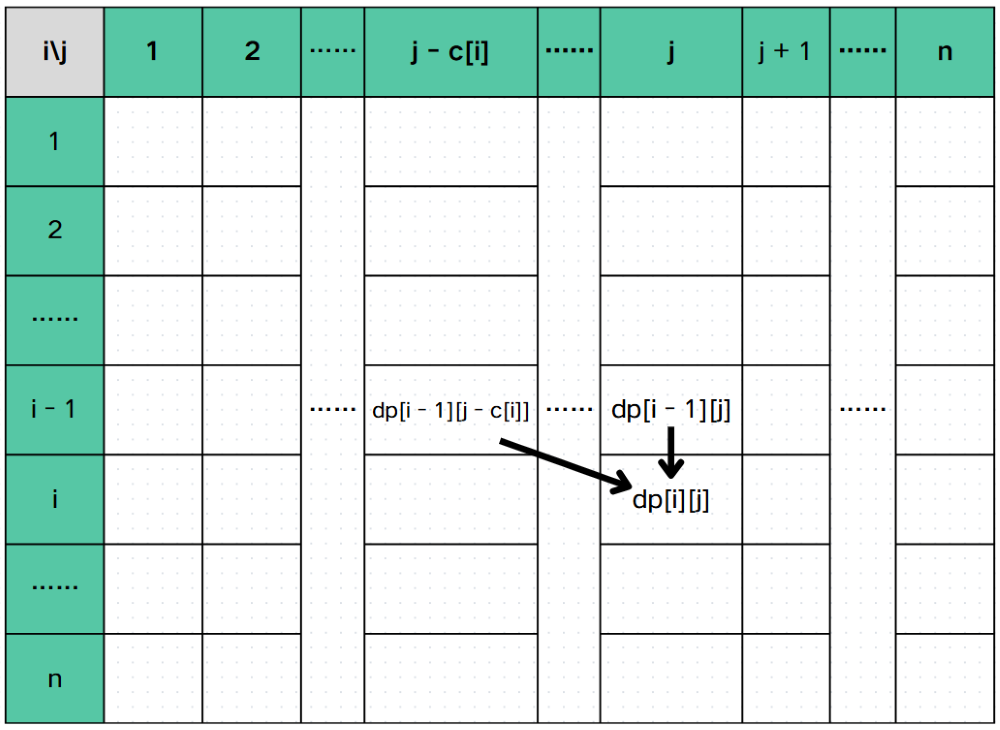

## 01 背包

>题目简介：有 `N` 个物品和一个容量为 `W` 的背包，每个物品价值为 `w[i]`， 重量为 `v[i]` 。在选出若干个物品在满足容量不超过 `W` 时，求最大价值是多少？

这是最基础的背包问题，观察后发现每个物品要么选（1），要么不选（0），所以我们通常称这种题型为 01背包。

### 思路
我们可以定义一个状态：`dp[i][j]` 代表前 `i` 个物品选恰好容量为 `j` 的背包里可以获得的最大价值。那么决策显然为两个：选或不选。如果选择装入当前物品，那么我们需要让背包腾出至少 `c[i]` 个容量用于装这个物品，而价值则加上这个物品的价值，即 `v[i]`。如果不选择装入当前物品，那么就是同样的空间装前 `i - 1` 个物品。

我们可以画一个表格来直接的理解：


通过整理和表格我们发现状态转移如下：
$$
dp[i][j] = max\begin{cases}
dp[i - 1][j] \\
dp[i - 1][j - c[i]] + v[i]
\end{cases}
$$
### Code
下面是一个 01背包在转移时代码：
```cpp
for (int i = 1; i <= n; i++) {
	for (int j = c[i]; j <= W; j++) {
		dp[i][j] = max(dp[i - 1][j], dp[i - 1][j - c[i]] + v[i])
	}
}
```
### 复杂度
这样的时间复杂度是 $O(NW)$，空间复杂度为 $O(NW)$。
### 滚动数组
01 背包的时间复杂度是不可优化的了，而空间复杂度可以优化为 $O(W)$ ，这个时候我们就需要使用滚动数组了。
#### 观察
通过观察发现 `dp[i][j]` 只可能是从上一行而且不超过这一列转移过来。具体来说 `dp[i][j]` 只可能是从 `dp[u][v]` 转移过来且 $1 \le u \le i - 1, \ 1 \le v \le j$ 。所以我们可以把 `N` 行压成 1 行，但是我们需要倒序来保证不把之前的覆盖。

#### Code
下面是一个使用了滚动数组的 01背包：
```cpp
for (int i = 1; i <= n; i++) {
	for (int j = W; j >= c[i]; j--) {
		dp[j] = max(dp[j], dp[j - c[i]] + v[i]);
	}
}
```
#### 复杂度
时间复杂度无法进行优化，即 $O(NW)$ ，空间复杂度为 $O(W)$
### 总结
01 背包是一个只有两个决策（选或不选）的背包。

状态转移：**减去话费获得价值**。