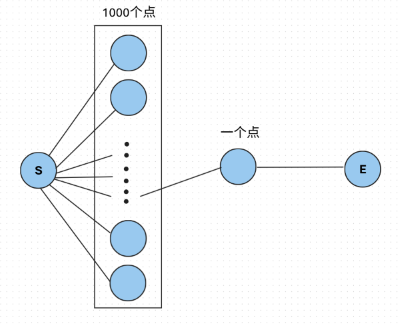
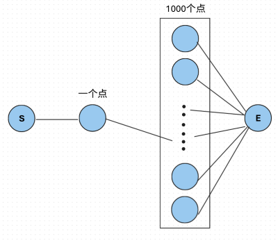

# BFS
广度优先搜索 (Breadth First Search) ，字面意思就是由广度优先的搜索方式。DFS是使用的 “不撞南墙不回头”，BFS 使用的是哪个店离自己距离越近，就先搜索那个点。

BFS 的实现是利用队列 `Queue` 来实现的，每次加入离自己距离最近的点，然后依次取出队列头进行相同的操作。下面是一个 BFS 的基本框架：

```cpp
#include <bits/stdc++.h>
using namespace std;

const int MAXN = 10005;

int vis[MAXN], dis[MAXN];
queue<int> q; // BFS需要的队列
vector<int> g[MAXN]; // 这里使用邻接表存储，也可以使用其他的存储方式。

void bfs(int st) {
	vis[st] = 1, dis[st] = 0;
	q.push(st);

	while (!q.empty()) {
		int u = q.front();
		q.pop();

		for (auto v : g[u]) { // v为下一个节点
			if (!vis[v]) {
				vis[v] = 1;
				dis[v] = dis[u] + 1;
				q.push(v);
			}
		}
	}
}
```
## 优化1：双向搜索
### 观察
在普通 `BFS` 时我们经常是从起点一点一点加边到终点。在加边的过程中，我们不管有多少边，就都都加进去了。但是遇到这样的图，我们就可能会超时：


这样发现，如果我们从终点开始搜索会更快，于是 `BFS` 改为从终点 $\to$ 起点，于是我们又遇到了一个问题，如果图张这样，那么我们还是会超时：


但是这样我们又发现，这样从起点开始比较好，更快。

### 总结
总结发现在写 `BFS` 时，不能直接从起点或终点出发，否则会遇到上面两种情况，会导致 `TLE`。

所以使用双向搜索来优化 `BFS`，这个用法是在优化 `BFS` 时可能要使用的，实现是从两侧展开分枝，哪边分枝少就从哪边展开。

### Code
下面是使用了双向搜索优化的 `BFS` 代码：
```cpp
#include <bits/stdc++.h>
using namespace std;

int main() {
	
	
	return 0;
}
```
# 0-1BFS / 双端队列 BFS
双端队列 BFS 就是使用双端队列的 BFS，但是有什么用呢？