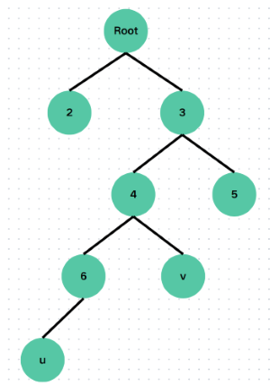

# LCA
最近公共祖先 `Least Common Ancestor` 是指在有根上树上两个点沿着祖先链向上第一次相遇的位置。

如下图，u 和 v 的最近公共祖先是节点 4 而不是节点 3，虽然节点 3 确实是 u 和 v 的祖先，但是不是最近的。


## 暴力法
如果要求 u 和 v 的 LCA 那么那个 LCA 一定同时出现在 u 到根节点的路径和 v 到根节点路径上，而且是第一个同时出现的位置。为了方便，思路就是先将 u 和 v 向上走到同一层，在一步一步向上移动，直到 u 和 v 相遇，这个相遇的点就一定是 u 和 v 的 LCA。

想要让 u 和 v 跳到同一层，得先知道 u 和 v 是那一层。$dep[u]$ 表示节点 u 离根的距离（也就是深度）。然后需要处理一个 $fa[u]$ 数组代表 u 的父亲的节点编号。

```cpp
int dep[MAXN], fa[MAXN]; // 2^35 >= 1e9, 所以够大了
void initlca(int u, int f) { // f是u的父节点
	dep[u] = dep[f] + 1;
	fa[u] = f;
	
	for (auto v : g[u]) { // 这里使用邻接表存储
		if (v != fa) initlca(v, u);
	}
}
```

接下来就到了写 LCA 函数的时候了，第一步是将 u 和 v 一步一步挪到同一层。然后第二部是一起向上挪，直到挪到同一个点上。

```cpp
int LCA(int u, int v) {
	if (dep[u] < dep[v]) swap(u, v); // 为了方便,u的深度比v更深（u和v的顺序不造成影响）
	while (dep[u] > dep[v]) {
		u = fa[u]; // 向上挪动
	}

	if (u == v) return u; // 如果直接挪到同一个节点了就返回LCA

	while (u != v) {
		u = fa[u];
		v = fa[v];
	}
	return u;
}
```
### 时间复杂度
暴力法需要预处理整棵树，所以复杂度为 $O(n)$ ，而单次查询的复杂度为 $O(n)$，因为如果树长成一条连，u 和 v 在两段求的时候需要一步一步向另一个节点挪，这样就是树的大小 $n$ 所以单次查询时间复杂度是 $O(n)$，有些慢。
## 倍增法
倍增法是暴力法改良而来，优化了一步一步向上挪，变成了倍增式向上挪，同时挪到时候也是使用了倍增的思想。

使用倍增方法我们需要将之前 $fa[u]$ 数组多加一维变成 $fa[u][i]$，表示 u 的 $2^{i}$ 辈祖先的节点编号，这可以帮助我们优化代码。
### 初始化的改变
在初始化 $fa$ 数组时会用到一个 `for` 循环长下面这个样子：

```cpp
fa[u][0] = f;
for (int i = 1; i <= 30; i++) {
	fa[u][i] = fa[fa[u][i - 1]][i - 1];
}
```

$fa[u][0] = f$ 这很容易理解就是初始化 u 的父亲。但是这个 `for` 循环是什么意思呢？观察发现 $fa[u][i - 1]$ 是 u 向上的第 $2^{i - 1}$ 辈的节点编号，而 $fa[fa[u][i - 1]][i - 1]$ 表示的是 u 向上第 $2 ^ i -1$ 的祖先编号的第 $2^i - 1$ 辈祖先的编号。而 $2^{i} = 2^{i - 1} + 2^{i - 1}$ ，所以初始化为 $fa[fa[u][i - 1]][i - 1]$ 。（这虽然有些绕，但是确实是这样的……）

### LCA 函数的改变
在 LCA 函数里主要有两处改变，第一处是在 u 自己向上**一步一步**变成**跳**， 这将变成这个样子：
```cpp
for (int i = 30; i >= 0; i++) {
	if (dep[fa[u][i]] >= dep[v]) u = fa[u][i];
}
```
这个其实很好理解，就是判断如果 u 向上跳 $2^{i}$ 辈的深度还是比 v 深或者相同，那么就跳。换句话说就是只要跳完之后的深度不超过 v 就可以跳。

第二处改变是在